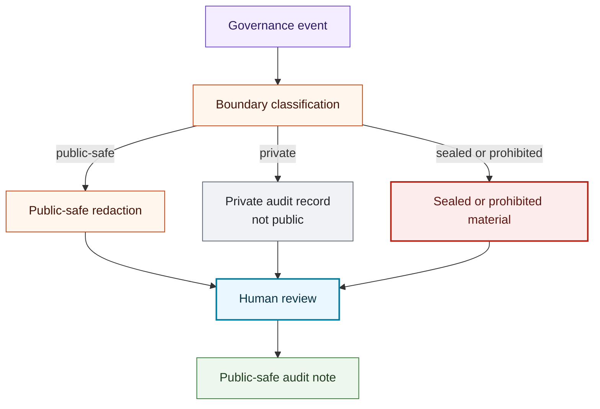

# Audit Log Flow

## Purpose

This graph shows how governance decisions become public-safe audit notes without exposing account data or prohibited trading content.

## Mermaid Diagram

## Interpretation Notes

- Audit logging starts with boundary classification.
- Private records do not become public logs.
- Public audit notes use sanitized summaries.

## Boundary Notes

- Account data, balances, returns, positions, strategies, signals, credentials, private prompts, private model outputs, and sealed IP are excluded.
- Audit notes are not performance records or compliance certification.

## Follow-Up Actions

- Keep synthetic audit examples free of account and performance fields.
- Add validation checks when new prohibited content categories are identified.
