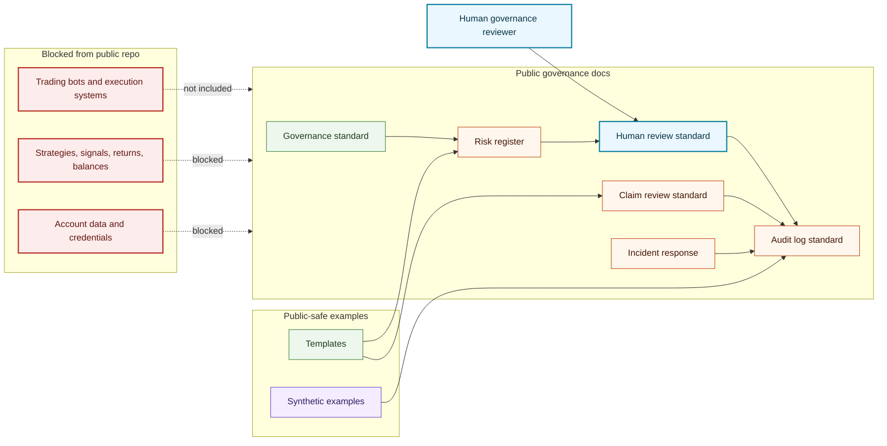

# Governance System Map

## Purpose

This graph shows the public governance documentation components for supervised trading-agent research systems without creating a trading bot or trading system.

## Mermaid Diagram

## Interpretation Notes

- The repository documents governance controls only.
- Human review controls risk acceptance, claim approval, and publication.
- Synthetic examples demonstrate structure without exposing real operations.

## Boundary Notes

- Trading bots, strategies, signals, returns, balances, account data, credentials, private prompts, private model outputs, and sealed IP are blocked.
- The map does not imply a live trading system exists.

## Follow-Up Actions

- Update diagrams if governance artifacts are added.
- Keep prohibited-content checks aligned with README and disclaimer language.
