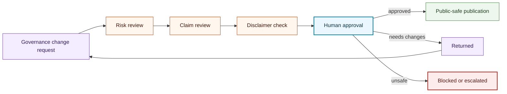

# Human Approval Flow

## Purpose

This graph shows the human approval gates required before governance changes, public claims, or publication.

## Mermaid Diagram

## Interpretation Notes

- Governance changes pass through risk, claim, and disclaimer checks.
- Human approval is required before publication.
- Unsafe changes are blocked or escalated.

## Boundary Notes

- Approval does not authorize trade execution or financial advice.
- Public-safe publication cannot include strategies, signals, returns, balances, account data, credentials, or private operations.

## Follow-Up Actions

- Keep human-review templates aligned with this flow.
- Add claim examples only when they are safe and disclaimer-backed.
