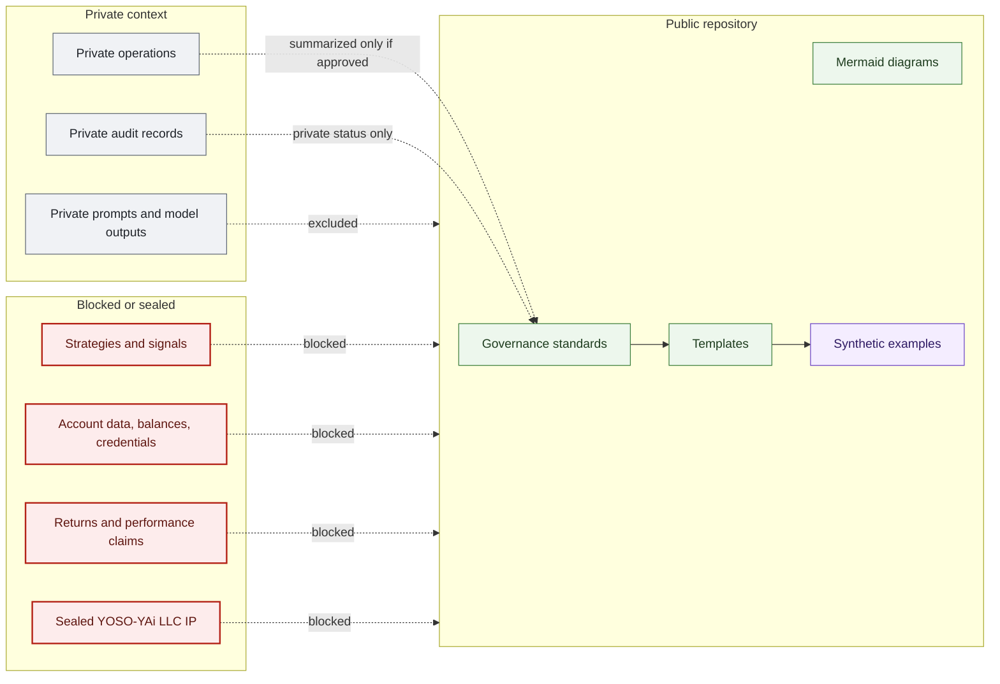

# Public Private Boundary Map

## Purpose

This graph shows what belongs in the public governance repository and what must remain private, sealed, or blocked.

## Mermaid Diagram

## Interpretation Notes

- Public content is limited to governance documentation and synthetic examples.
- Private audit records and operational details are excluded.
- Strategies, signals, account data, returns, and performance claims are blocked.

## Boundary Notes

- Donor data, student data, volunteer private data, customer data, private Foundation operations, exact sensitive infrastructure locations, private training corpora, secrets, tokens, and security-sensitive NEURONA operational details are excluded.
- This graph does not imply a live trading system exists.

## Follow-Up Actions

- Review every new template and example against this boundary map.
- Keep disclaimer and prohibited-content language synchronized.
