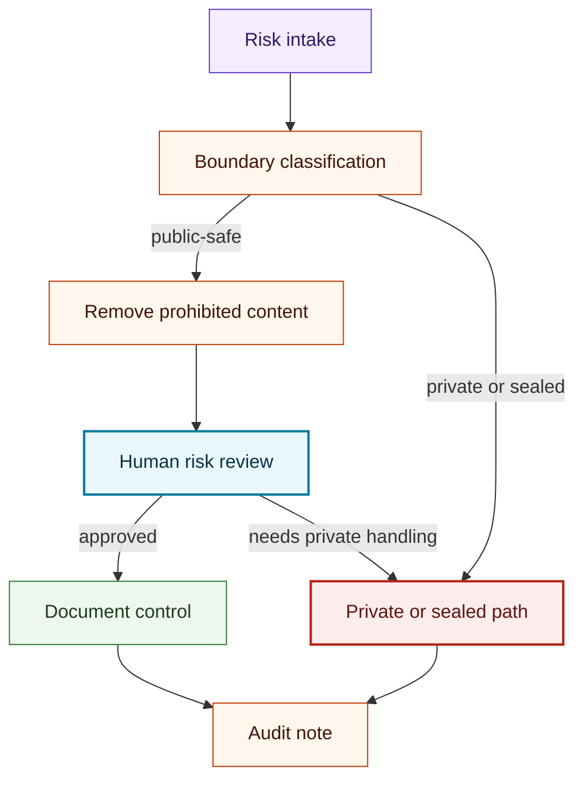

# Risk Review Flow

## Purpose

This graph shows how public-safe risk register entries move through review without exposing private strategy, account data, or trading claims.

## Mermaid Diagram

## Interpretation Notes

- Boundary classification happens before risk details are public.
- Prohibited content is removed before public documentation.
- Private or sealed risks use a non-public path.

## Boundary Notes

- Strategies, signals, account data, credentials, and performance details cannot be placed in public risk entries.
- Audit notes must stay public-safe.

## Follow-Up Actions

- Keep risk-register templates free of market, account, and performance fields.
- Add new risk categories only when they can be documented without prohibited content.
